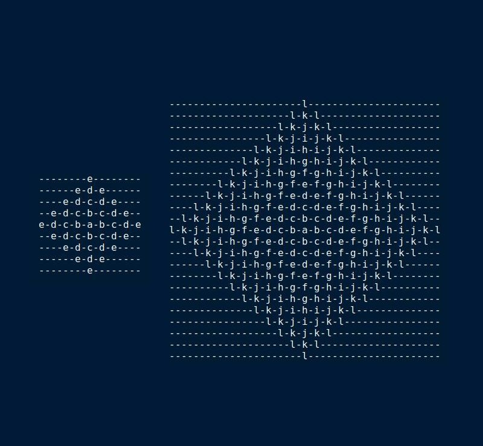

# Rust Alphabet Rangoli

A [rangoli](https://en.wikipedia.org/wiki/Rangoli) is beautiful form of art originating in India. The idea of creating a rangoli utilizing letters from the English alphabet came from a Python programming challenge. Below are samples that illustrate rangoli patterns in text.

## Command Line Interface Version

At the root level of this repo, we build and execute the workspace using Cargo:

`$> cargo build -p raylib-alpha-rangoli`

`$> cargo run -p raylib-alpha-rangoli -- -n 5` 

The second Cargo command uses the first five letters of the alphabet, `a-e`, to generate the rangoli pattern. The text output is the first example shown above. The second one shows a 12 letter pattern.

## Raylib Version

TBD.