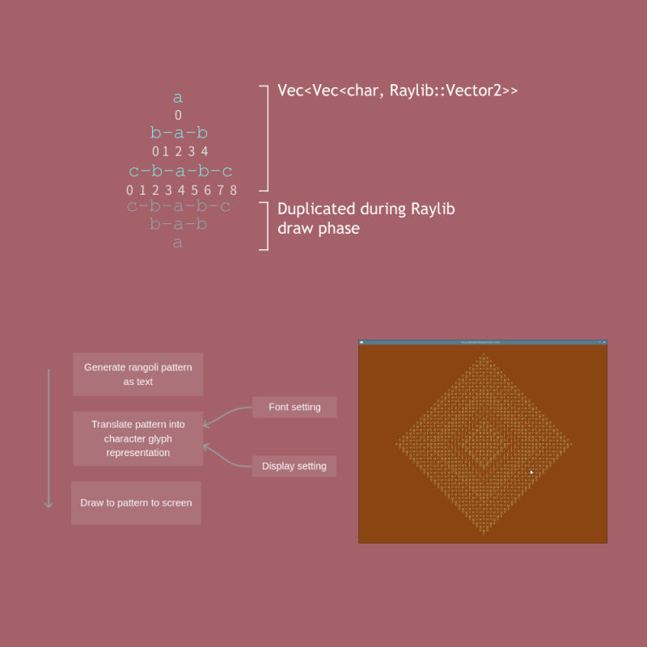

# Rust Alphabet Rangoli

A [rangoli](https://en.wikipedia.org/wiki/Rangoli) is beautiful form of art originating in India. The idea of creating a rangoli utilizing letters from the English alphabet came from a Python programming challenge. Below are samples that illustrate rangoli patterns in text.

## Command Line Interface Version

At the root level of this repo, we build and execute the workspace using Cargo:

`$> cargo build -p raylib-alpha-rangoli`

`$> cargo run -p raylib-alpha-rangoli -- -n 5` 

The second Cargo command uses the first five letters of the alphabet, `a-e`, to generate the rangoli pattern. The text output is the first example shown above. The second one shows a 12 letter pattern.

## Raylib Version: From Text to Glyph

Intially our code generates the Rangoli pattern as text, stored in a `Vec<String>`, where each vector entry is a row in the pattern. With this in hand, the program translate the characters into *glyphs* for display. Depending on the dimensions of the 2D display area, and depending also on the font, our code calculates the x- and y-coordinate of each alphabet in the pattern to draw. 

1. Each row in the Rangoli pattern has an odd number of characters.
2. In the textual representation, a delimeter `'-'` separates alphabet characters. We note that this delimiter is always at an even index. When transforming the pattern from text to glyph, it's a simple matter of ignoring every even character in the row to filter only the alphabet characters.
3. In terms of *unit objects* to draw to the screen, we logically represent each character in the pattern as a glyph and a 2D coordinate. In our code, we've encapsulated this as `struct AlphaToDisplay`.
4. Conceptually we pack the pattern into rows, each one made up of *draw cells* of uniform height and width. We rely on `Raylib::measure_text()` to calculate the width of each character, using the widest width as the basis of determining the dimension of a draw cell. This way Raylib draws each glyph uniformly across a row, normalizing variations in character width as determined by the given font set. 
5. As indicated in the diagram above, we construct a sort-of two dimension sparse matrix data structure, a vector nested within a vector. The outer vector represents the rows of the Rangoli pattern. The inner vector collects the characters that make up a row, each one a unit object for drawing: `struct AlphaToDisplay<char, Vector2>`.
6. Our program only needs to handle the upper half of the Rangoli pattern. (Visually, the upper traingle of the diamond Rangoli pattern.) To mirror the lower half, we simply duplicate the rows in the opposite row order, adjusting the y-coordinate for the lower half characters as we build the sparse matrix. We deal with this sort of complexity up front, reusing the same data structure without further alterations, in order to keep the Raylib draw calls quick and simple.