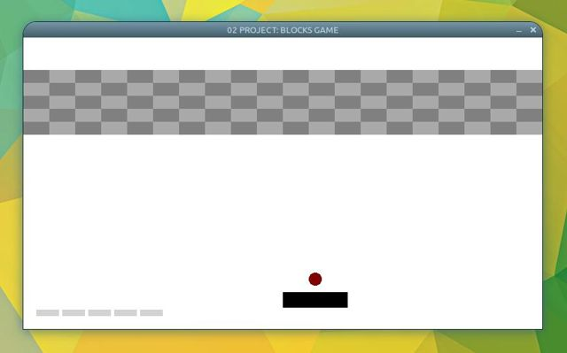

# Declaration of an Array Initialized with Struct Elements

In the raylib game we have a two dimensional field of bricks running across near the top of the viewport. This appears as a block of bricks of alternating shades of gray. 



In the original raylib-C code, this is represented by the `Brick` structure aggregated as a 2D array, `bricks`.

```
typedef struct Brick {
    Vector2 position;
    Vector2 size;
    Rectangle bounds;
    int resistance;
    bool active;
} Brick;

Brick bricks[BRICKS_LINES][BRICKS_PER_LINE] = { 0 };
```
How do we translate this to Rust?

In a number of discussions online, people propose using vectors-of-vectors, which seems convoluted and a few steps away from the array-like semantics of the original C implementation. An elegant solution using the **array-init crate** came up [here](https://users.rust-lang.org/t/initializing-an-array-of-structs/36586/7) (see Yandros' remark). The key take-away ideas are:

1. Have the brick struct derive Clone and implement a `new()` method. This method initializes the struct fields with default (zeroed, false) values.
   
2. Code the 2D array as a one-dimensional array of bricks embedded in another struct. For the `new()` method of this second struct, we call on `::array-init::array_init()` (yes, mind the spelling there!), a closure that calls the `new()` method of the embedded brick struct to initialize each element of the array.

To retain the array-like interface of the original C code, we also implement another method in the second struct that maps a `[i][j]` indices to the one-dimensional array, returning a mutable reference to the specific brick struct. 

```
use ::array_init::array_init;

[derive(Clone, Debug)]
struct Brick {
    position: Vector2,
    size: Vector2,
    bounds: Rectangle,
    resistance: i32,
    active: bool,
}

impl Brick {
    fn new() -> Brick {
        Brick {
            position: Vector2::new(0.0, 0.0),
            size: Vector2::new(0.0, 0.0),
            bounds: Rectangle::new(0.0, 0.0, 0.0, 0.0),
            resistance: 0,
            active: false,
        }
    }
}

[derive(Debug)]
struct BrickField {
    bricks: [Brick; (BRICKS_LINES * BRICKS_PER_LINE) as usize],
}

impl BrickField {
    fn new() -> BrickField {
        BrickField {
            bricks: array_init(|_| Brick::new()),
        }
    }

    fn get_mut(&mut self, x: i32, y: i32) -> &mut Brick {
        &mut self.bricks[((y * BRICKS_LINES) + x) as usize]
    }
}
```

And here is how we initialize our array-of-structs:

```

let mut target_bricks = BrickField::new();

for j in 0..BRICKS_LINES {
    for i in 0..BRICKS_PER_LINE {
        let brick = target_bricks.get_mut(j, i);
        brick.size = Vector2::new((SCREEN_WIDTH / BRICKS_PER_LINE) as f32, 20.0);
        brick.position = Vector2::new(
            ((i as f32) * brick.size.x),
            (j as f32) * brick.size.y + (BRICKS_POSITION_Y as f32),
        );
        brick.bounds = Rectangle::new(
            brick.position.x,
            brick.position.y,
            brick.size.x,
            brick.size.y,
        );
        brick.resistance = 0;
        brick.active = true;
    }
}
```

References:

1. [array-init crate](https://crates.io/crates/array-init)

2. Worth mentioning, [ArrayVec](https://doc.servo.org/arrayvec/struct.ArrayVec.html)
